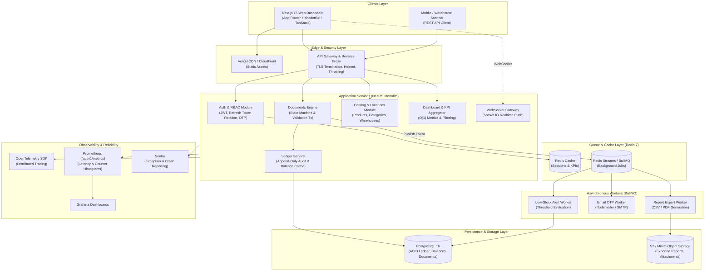
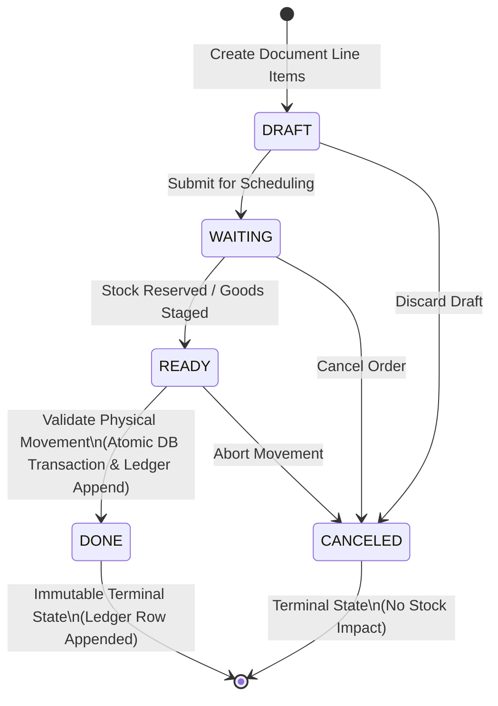
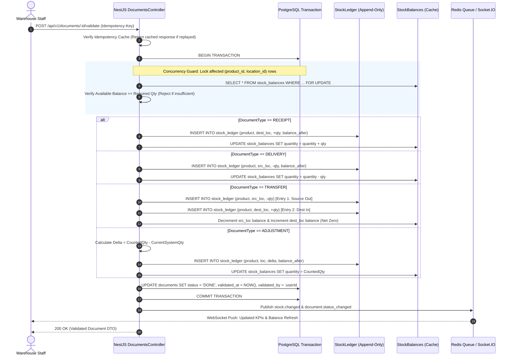
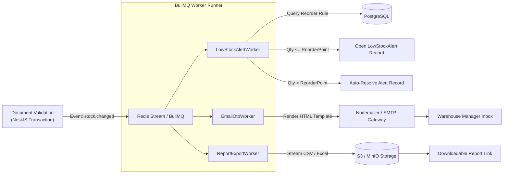
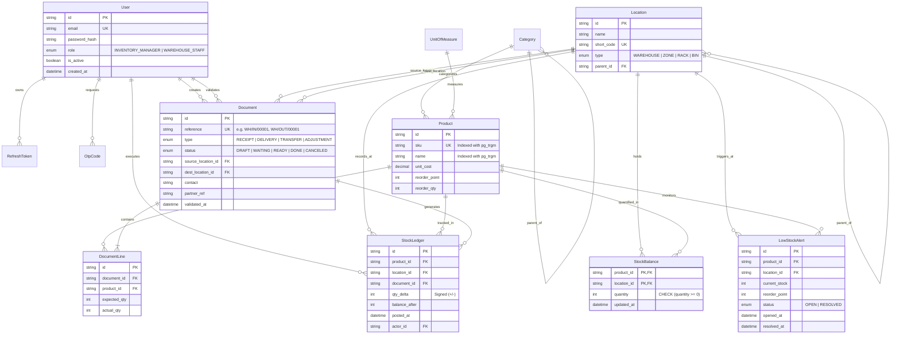

# StockSense — Intelligent Ledger-Backed Inventory Management System

[](https://github.com/chityalasrakshin/StockSense/actions)
[](https://www.typescriptlang.org/)
[](https://nextjs.org/)
[](https://nestjs.com/)
[](https://www.postgresql.org/)
[](https://www.prisma.io/)
[](https://redis.io/)
[](https://bullmq.io/)
[](https://playwright.dev/)
[](https://opensource.org/licenses/MIT)

> **StockSense** is a production-grade, stateful, ledger-backed Inventory Management System (IMS) architected to unify product catalogs, multi-warehouse storage hierarchies, and stock movements into a single resilient workspace. Inspired by the proven domain architectures of **Odoo** and **ERPNext**, StockSense eliminates naive mutable stock counts in favor of an **immutable, append-only Stock Ledger** driven by formal operational documents.

---

## Table of Contents

1. [Executive Summary & Problem Statement](#1-executive-summary--problem-statement)
2. [The StockSense Solution & Core Invariants](#2-the-stocksense-solution--core-invariants)
3. [Complete Solution Architecture](#3-complete-solution-architecture)
   - [High-Level System Topology](#high-level-system-topology)
   - [Document Lifecycle State Machine](#document-lifecycle-state-machine)
   - [Transactional Validation Engine (Row-Locked)](#transactional-validation-engine-row-locked)
   - [Asynchronous Event & Worker Pipeline](#asynchronous-event--worker-pipeline)
   - [Database Entity Relationship Diagram (ERD)](#database-entity-relationship-diagram-erd)
4. [Core Business Workflows](#4-core-business-workflows)
   - [1. Receipts (Incoming Stock)](#1-receipts-incoming-stock)
   - [2. Delivery Orders (Outgoing Stock)](#2-delivery-orders-outgoing-stock)
   - [3. Internal Transfers (Inter-Location Movement)](#3-internal-transfers-inter-location-movement)
   - [4. Stock Adjustments (Physical Reconciliation)](#4-stock-adjustments-physical-reconciliation)
   - [5. Move History (Immutable Forensic Audit Trail)](#5-move-history-immutable-forensic-audit-trail)
5. [The Canonical Worked Example (Jury Demo Walkthrough)](#5-the-canonical-worked-example-jury-demo-walkthrough)
6. [Multi-Warehouse & Hierarchical Location Topology](#6-multi-warehouse--hierarchical-location-topology)
7. [Security Architecture & Role-Based Access Control (RBAC)](#7-security-architecture--role-based-access-control-rbac)
8. [Technology Stack](#8-technology-stack)
9. [Repository Monorepo Layout](#9-repository-monorepo-layout)
10. [REST API Specification & Contract](#10-rest-api-specification--contract)
11. [Background Workers & Event Processing](#11-background-workers--event-processing)
12. [Observability, Metrics & Sentry Integration](#12-observability-metrics--sentry-integration)
13. [Getting Started & Local Development](#13-getting-started--local-development)
14. [Running with Docker Compose](#14-running-with-docker-compose)
15. [Testing & Quality Assurance](#15-testing--quality-assurance)
16. [Architectural Decision Records (ADRs)](#16-architectural-decision-records-adrs)
17. [Production Deployment & Infrastructure](#17-production-deployment--infrastructure)
18. [Roadmap](#18-roadmap)
19. [License & Acknowledgments](#19-license--acknowledgments)

---

## 1. Executive Summary & Problem Statement

### The Industrial Reality

Modern manufacturing, distribution, and warehousing operations manage thousands of fast-moving SKUs across disparate physical facilities, zones, racks, and bins. Despite advances in software, mid-market enterprises frequently suffer from:

- **Spreadsheet & Paper Register Chaos**: Critical stock movements are recorded on paper goods-receipt notes or disconnected spreadsheets, introducing human data entry latency and transcription errors.
- **Phantom Inventory & Stockouts**: Systems report items in stock that have already been physically dispatched or promised to another order, leading to delayed fulfillment, customer churn, and emergency reorders.
- **Concurrency Anomalies**: When multiple warehouse personnel receive, pick, or transfer the same SKU concurrently, traditional databases suffer race conditions that create negative balances or double-allocated stock.
- **Untraceable Shrinkage & Loss**: Damaged materials, scrap, and shrinkage are either swept under the rug or overwritten without an immutable audit trail showing who approved the change, when, and why.
- **Flaky Network Replays**: Mobile warehouse terminals operating over spotty Wi-Fi retry network requests, accidentally creating duplicate receipts or multiple picking deductions.

### The Naive CRUD Anti-Pattern

Most generic inventory demos on GitHub implement stock as a simple mutable integer:

```sql
-- NAIVE ANTI-PATTERN: Fails under concurrency, leaves zero audit trail
UPDATE products SET current_stock = current_stock - 10 WHERE id = 'prod-123';
```

This naive approach is unacceptable for production supply chains:

1. **Zero Provenance**: If stock drops from 100 to 90, there is no proof whether it was dispatched, transferred, damaged, or stolen.
2. **Race Conditions**: Two simultaneous requests checking `current_stock >= 10` can both succeed, driving actual physical inventory negative.
3. **No Dual-Entry Accounting**: An internal transfer between two bins within the same warehouse cannot be cleanly represented without affecting overall company stock.

---

## 2. The StockSense Solution & Core Invariants

StockSense reframes inventory management from "a CRUD app with a dashboard" to **"an event-sourced, document-driven stock ledger with real-time operational intelligence."**

```
┌────────────────────────────────────────────────────────────────────────────────────────┐
│                                STOCKSENSE CORE ENGINE                                  │
│                                                                                        │
│   [ Operational Document ]                                                             │
│   • Receipt (IN)                                                                       │
│   • Delivery (OUT)        Atomic Validation         [ Immutable Stock Ledger ]         │
│   • Transfer (INTERNAL)  ───────────────────►       • Append-only (Never UPDATE/DELETE) │
│   • Adjustment (DELTA)   SELECT ... FOR UPDATE      • Complete historical provenance    │
│                                   │                                                    │
│                                   ▼                                                    │
│                          [ Derived Read Cache ] ──► Fast O(1) Dashboard KPIs           │
│                          (stock_balances)       ──► Auto Low-Stock Alerts               │
└────────────────────────────────────────────────────────────────────────────────────────┘
```

### The Non-Negotiable System Invariants

1. **Document-Driven Stock Mutations**: Every single inventory modification must originate from a formal operational document (`RECEIPT`, `DELIVERY`, `TRANSFER`, `ADJUSTMENT`). Direct SQL edits to balances are strictly prohibited.
2. **The Validation Gate**: Documents move through an explicit state machine: `DRAFT ➔ WAITING ➔ READY ➔ DONE` (or `CANCELED`). **Stock only changes upon validation (`DONE`), never on creation or during drafting.**
3. **Append-Only Immutable Stock Ledger**: Every physical movement appends an immutable row to `stock_ledger`. Ledger records are never modified (`UPDATE`) or purged (`DELETE`).
4. **Dual-Model Ledger & Read Cache**:
   - `stock_ledger` is the authoritative audit trail.
   - `stock_balances` is an indexed, derived read-model cache updated inside the **exact same database transaction** to ensure instant $O(1)$ dashboard reads without recalculating history on every page load.
5. **Location Hierarchy & Dual-Entry Transfers**: Stock is tracked per `Product × Location`. Internal transfers write **two ledger entries** within one transaction (negative delta at source, positive delta at destination), preserving the invariant that total company stock remains unchanged.
6. **Strict Concurrency Safety**: Validating a document executes inside an ACID PostgreSQL transaction utilizing row-level locks (`SELECT ... FOR UPDATE`) on the target `stock_balances` rows, eliminating double-allocation and race conditions.
7. **Availability & Non-Negative Enforcement**: Delivery orders and transfers fail validation if available stock at the source location is insufficient. A database-level `CHECK (quantity >= 0)` constraint guarantees inventory never drops below zero.
8. **Network Idempotency**: All validation requests accept an `Idempotency-Key` header. Duplicate calls caused by spotty warehouse Wi-Fi replay the cached result without double-posting ledger entries.
9. **Event-Driven Low-Stock Alerting**: Stock adjustments evaluate reorder thresholds asynchronously via Redis Streams and BullMQ, opening self-resolving alerts that automatically resolve once stock recovers.
10. **Role-Based Operational Separation**: Inventory Managers maintain master catalogs, reorder policies, and adjustment approvals; Warehouse Staff execute picking, receiving, shelving, and counting.

---

## 3. Complete Solution Architecture

### High-Level System Topology



---

### Document Lifecycle State Machine

Every operational movement is tracked through a finite state machine:



---

### Transactional Validation Engine (Row-Locked)

When a warehouse manager or staff member clicks **Validate**, the backend executes a single ACID transaction to guarantee zero data loss and concurrency safety:



---

### Asynchronous Event & Worker Pipeline

StockSense decouples heavy asynchronous notifications and alert calculations from the synchronous validation request path:



---

### Database Entity Relationship Diagram (ERD)

The relational schema strictly enforces foreign keys, unique short codes, and append-only constraints:



---

## 4. Core Business Workflows

StockSense categorizes all warehousing tasks into four discrete, standardized operations:

### 1. Receipts (Incoming Stock)

- **Goal**: Receive raw materials, hardware, or merchandise from vendors into a target warehouse location.
- **Workflow**:
  1. Staff creates a `RECEIPT` document, selects a destination warehouse (e.g., `Main Warehouse`), specifies the vendor/contact, and inputs partner reference (e.g., `PO-2026-STEEL-001`).
  2. Products and expected quantities are added as line items.
  3. Staff transitions document to `READY` when trucks arrive and goods are offloaded.
  4. On **Validate**, the backend increments `stock_balances` and writes an immutable `IN` record (`qtyDelta > 0`) to `stock_ledger`.

### 2. Delivery Orders (Outgoing Stock)

- **Goal**: Dispatch ordered items to customers or external manufacturing partners.
- **Workflow**:
  1. Create a `DELIVERY` document selecting source warehouse, destination customer, and itemized quantities.
  2. The system dynamically verifies **"Free to Use"** stock:
     $$\text{Free to Use} = \text{Current Balance} - \sum \text{Reserved Quantities in Pending Outgoing Orders}$$
  3. Staff picks, packs, and validates the order.
  4. On **Validate**, stock balance is decremented and an `OUT` record (`qtyDelta < 0`) is appended to `stock_ledger`. If available stock is insufficient, validation is aborted.

### 3. Internal Transfers (Inter-Location Movement)

- **Goal**: Relocate inventory between warehouses, racks, or bins (e.g., moving raw materials from Bulk Storage to Production Rack).
- **Workflow**:
  1. Select source location and destination location.
  2. Input products and transfer quantities.
  3. On **Validate**, the transaction executes a **dual-entry ledger write**:
     - Entry A: Negative delta at source location (`-qty`).
     - Entry B: Positive delta at destination location (`+qty`).
  4. **Company-wide net inventory remains perfectly invariant (net zero change).**

### 4. Stock Adjustments (Physical Reconciliation)

- **Goal**: Reconcile discrepancies identified during physical inventory counts (loss, damage, shrinkage, found stock).
- **Workflow**:
  1. Select warehouse/rack and product to audit. The system displays the current recorded system balance.
  2. Staff inputs the actual physically counted quantity and justification reason.
  3. The engine computes:
     $$\Delta = \text{Physically Counted Quantity} - \text{System Balance}$$
  4. On **Validate**, the balance is updated to the counted quantity, and a signed delta entry is appended to `stock_ledger`.

### 5. Move History (Immutable Forensic Audit Trail)

- Every single validation automatically surfaces in the **Move History** module.
- Inventory managers can filter by product, warehouse location, document reference, date range, or movement type.
- Records provide complete forensic provenance: exactly who validated the transaction, timestamp, physical delta, and resulting balance.

---

## 5. The Canonical Worked Example (Jury Demo Walkthrough)

To verify the end-to-end integrity of StockSense, the system comes pre-seeded with the exact industrial steel manufacturing scenario demonstrated during jury evaluations:

| Step  | Operation             | Document Reference | Product                         | Location Details                                                                           |        Delta        | System Impact                                                                                                                       |
| :---: | :-------------------- | :----------------- | :------------------------------ | :----------------------------------------------------------------------------------------- | :-----------------: | :---------------------------------------------------------------------------------------------------------------------------------- |
| **1** | **Receipt**           | `WH/IN/00001`      | Steel Rods (`STEEL-ROD-001`)    | Received into `Main Warehouse` from _Vandertramp Steels Ltd._                              |     **+100 kg**     | Main Warehouse balance becomes **100 kg**. Single ledger entry posted.                                                              |
| **2** | **Internal Transfer** | `WH/OUT/00001`     | Steel Rods                      | Transferred from `Main Warehouse` to `Production Rack`                                     | **-30 kg / +30 kg** | Main Warehouse balance becomes **70 kg**; Production Rack becomes **30 kg**. Net company change = 0 kg. Dual ledger entries posted. |
| **3** | **Delivery Order**    | `WH/OUT/00002`     | Steel Rods                      | Dispatched from `Main Warehouse` to customer _Azure Interior_                              |     **-20 kg**      | Main Warehouse balance becomes **50 kg**. Outgoing ledger entry posted.                                                             |
| **4** | **Adjustment**        | `WH/OUT/00003`     | Steel Rods                      | Physical count at `Main Warehouse`: expected 50 kg, counted **47 kg** (3 kg damaged/scrap) |      **-3 kg**      | Main Warehouse balance updated to **47 kg**. Signed delta entry (-3) posted to ledger.                                              |
| **5** | **Alert Trigger**     | _Background Event_ | Industrial Bolts & Office Desks | Current balances = 0; Reorder points = 50 & 10                                             |       **N/A**       | BullMQ worker registers **OPEN** low-stock alerts visible on the Dashboard overview.                                                |

---

## 6. Multi-Warehouse & Hierarchical Location Topology

StockSense models storage locations as a self-referencing tree structure capable of representing deep warehouse hierarchies:

```text
Main Warehouse [WH] (WAREHOUSE)
├── Receiving Bay A [WH-REC] (ZONE)
│   ├── Inbound Staging Bin 01 [WH-REC-B01] (BIN)
│   └── Inbound Inspection [WH-REC-INSP] (BIN)
├── Production Rack 01 [WH-PR] (RACK)
│   ├── Shelf Level 1 [WH-PR-L1] (BIN)
│   └── Shelf Level 2 [WH-PR-L2] (BIN)
└── Finished Goods Shipping [WH-SHP] (ZONE)
```

- **Short-Code Generation**: Every location has an immutable, unique alphanumeric code (e.g. `WH`, `WH-PR`, `WH-REC`).
- **Document Prefixes**: Documents automatically derive human-readable serial numbers formatted as:
  $$\langle \text{Warehouse Short Code} \rangle / \langle \text{IN or OUT} \rangle / \langle \text{Zero-Padded Sequence} \rangle$$
  _(e.g., `WH/IN/00001`, `WH/OUT/00001`, `WH/OUT/00002`)_.

---

## 7. Security Architecture & Role-Based Access Control (RBAC)

StockSense implements an enterprise security perimeter adhering to the principle of least privilege:

```
┌────────────────────────────────────────────────────────────────────────┐
│                        STOCKSENSE RBAC BOUNDARY                        │
│                                                                        │
│   INVENTORY_MANAGER                     WAREHOUSE_STAFF                │
│   • Full catalog control (CRUD)         • View products & stock levels │
│   • Multi-warehouse setup & bins        • Create & validate Receipts   │
│   • Create & validate Adjustments       • Pick, pack, validate Deliv.  │
│   • Approve reorders & view alerts      • Execute internal transfers   │
│   • Access full audit reports           • View move history            │
└────────────────────────────────────────────────────────────────────────┘
```

### Granular Permission Matrix

| Capability / Resource     | Endpoint / Action                                                | `INVENTORY_MANAGER` |  `WAREHOUSE_STAFF`  |
| :------------------------ | :--------------------------------------------------------------- | :-----------------: | :-----------------: |
| **Authentication**        | `POST /auth/login`, `POST /auth/refresh`, `POST /auth/otp/*`     |         ✅          |         ✅          |
| **Catalog Management**    | `POST /products`, `PATCH /products/:id`, `POST /categories`      |         ✅          |  ❌ _(Read-Only)_   |
| **Warehouse Hierarchy**   | `POST /warehouses/locations`, `PATCH /warehouses/:id`            |         ✅          |  ❌ _(Read-Only)_   |
| **Receipt Operations**    | Create, stage, and validate incoming stock (`RECEIPT`)           |         ✅          |         ✅          |
| **Delivery Operations**   | Create, pick, pack, and validate customer shipments (`DELIVERY`) |         ✅          |         ✅          |
| **Internal Transfers**    | Relocate stock between warehouses, racks, and bins (`TRANSFER`)  |         ✅          |         ✅          |
| **Inventory Adjustments** | Create and validate physical count reconciliation (`ADJUSTMENT`) |         ✅          | ❌ _(Manager Only)_ |
| **Stock Ledger & Audit**  | Query immutable audit trail (`GET /ledger`)                      |         ✅          |         ✅          |
| **System Dashboard**      | High-level financial KPIs, out-of-stock KPIs, alerts             |         ✅          | ✅ _(Operational)_  |

### Authentication & Token Rotation Specs

1. **Short-Lived Access Tokens**: Signed JWTs with a 15-minute time-to-live (TTL).
2. **Rotating Refresh Tokens**: Database-tracked tokens stored in secure, `httpOnly`, `sameSite=lax` cookies with a 7-day TTL.
3. **Token Reuse Detection**: If a previously consumed or revoked refresh token is presented, the system revokes the entire token family, forcing re-authentication to prevent replay attacks.
4. **Cryptographic OTP Password Reset**: 6-digit numeric OTP hashed with `bcrypt` (cost factor 10) before storage, protected by a 5-minute expiration window and hard rate limits.
5. **Transport Hardening**: Enforced via Helmet security headers, CORS origin whitelisting, and strict request throttling via `@nestjs/throttler`.

---

## 8. Technology Stack

StockSense is unified under a high-performance, single-standard TypeScript monorepo:

| Layer                     | Technology                      |   Version   | Purpose & Rationale                                                                  |
| :------------------------ | :------------------------------ | :---------: | :----------------------------------------------------------------------------------- |
| **Monorepo**              | pnpm Workspaces                 |    v10+     | Fast, disk-efficient dependency sharing across backend, frontend, and workers.       |
| **Frontend Framework**    | Next.js (App Router)            |    16.2     | Server-side rendering, layout streaming, and React Server Components.                |
| **UI Library**            | shadcn/ui & Tailwind CSS        |     v4      | Accessible, accessible components styled with modern design tokens.                  |
| **State & Data Fetching** | TanStack Query & TanStack Table |   v5 / v8   | Client caching, optimistic updates, pagination, and server prefetching.              |
| **URL State Sync**        | nuqs                            |    v2.8     | Bidirectional sync of table filters, pagination, and sorting with browser URL.       |
| **Backend Framework**     | NestJS                          |    10.4     | Enterprise modular monolith with strict Dependency Injection and clean architecture. |
| **Database ORM**          | Prisma ORM                      |     6.4     | Type-safe schema definition, declarative migrations, and client generation.          |
| **Primary Database**      | PostgreSQL                      |     16      | Relational persistence, ACID transactions, `SELECT ... FOR UPDATE`, and `pg_trgm`.   |
| **Cache & Queue**         | Redis                           |      7      | Session caching, rate limiting, and Redis Streams messaging backend.                 |
| **Job Queue**             | BullMQ                          |     6.3     | Robust background processing for email OTP, alerts, and asynchronous exports.        |
| **Realtime WebSockets**   | Socket.IO                       |     4.8     | Low-latency live push of stock mutations and document state changes to clients.      |
| **Logging**               | Pino                            |     9.6     | High-throughput structured JSON logging with request correlation IDs.                |
| **Observability**         | OpenTelemetry & Prometheus      | 0.57 / 15.1 | Distributed tracing and `/api/v1/metrics` Prometheus histogram exposition.           |
| **Error Monitoring**      | Sentry                          |    8.55     | Real-time crash alerting and transaction tracing across frontend and backend.        |
| **E2E Testing**           | Playwright                      |    1.63     | Multi-browser headless and headed end-to-end automation.                             |
| **Load Testing**          | k6                              |   Latest    | High-concurrency load testing validating idempotency and row locks.                  |

---

## 9. Repository Monorepo Layout

```text
StockSense/
├── frontend/                          # Next.js 16 App Router web client
│   ├── src/
│   │   ├── app/                       # Route groups: (auth) and (dashboard)
│   │   │   ├── (auth)/                # /login, /register, /forgot-password, /verify-otp
│   │   │   └── (dashboard)/           # /overview, /products, /receipts, /deliveries,
│   │   │                              # /transfers, /adjustments, /move-history, /settings
│   │   ├── features/                  # Domain modules (api, components, schemas)
│   │   │   ├── auth/                  # Login forms, OTP reset wizard, auth session hook
│   │   │   ├── products/              # Product catalog table, creation dialog, search
│   │   │   ├── documents/             # Reusable multi-step Document Wizard (Header, Lines, Review)
│   │   │   └── dashboard/             # Core KPI cards, movement streams, status charts
│   │   ├── components/                # shadcn/ui primitives & layout shell (Sidebar, Header)
│   │   └── lib/                       # Typed API client, query client, cookie handlers
│   └── vitest.config.mts              # Frontend unit test configuration
│
├── backend/                           # NestJS modular monolith API
│   ├── src/
│   │   ├── modules/
│   │   │   ├── auth/                  # JWT auth, refresh token rotation, OTP reset, RBAC guards
│   │   │   ├── products/              # Product master data, SKU uniqueness, pg_trgm fuzzy search
│   │   │   ├── categories/            # Product category hierarchical tree
│   │   │   ├── uoms/                  # Units of Measure (kg, pcs, box)
│   │   │   ├── warehouses/            # Location tree (Warehouse, Zone, Rack, Bin)
│   │   │   ├── documents/             # Stateful workflow engine & transactional validation
│   │   │   │   └── services/          # Idempotency service & Redis event publisher
│   │   │   ├── ledger/                # Append-only stock_ledger service & balance cache
│   │   │   ├── dashboard/             # High-performance KPI aggregator
│   │   │   └── realtime/              # Socket.IO WebSocket gateway
│   │   ├── common/                    # Global filters, Prisma service, metrics interceptors
│   │   ├── config/                    # Zod-validated environment schema
│   │   └── main.ts                    # Bootstrap with /api/v1 prefix, Swagger at /api/docs
│   └── prisma/schema.prisma           # Complete authoritative PostgreSQL schema
│
├── workers/                           # Standalone BullMQ worker runner
│   └── src/
│       ├── workers/                   # low-stock-alert, email-otp, report-export processors
│       ├── email/                     # Nodemailer SMTP and console email templates
│       └── index.ts                   # Worker process initialization & Redis binding
│
├── database/                          # Database infrastructure & seed scripts
│   ├── schema.sql                     # Raw PostgreSQL DDL with check constraints & trigram indexes
│   └── seed.ts                        # Deterministic, idempotent demo dataset seeding
│
├── docker/                            # Dockerfiles & container definitions
│   ├── backend.Dockerfile             # Multi-stage production container for NestJS API
│   ├── frontend.Dockerfile            # Multi-stage production container for Next.js
│   ├── workers.Dockerfile             # Production container for BullMQ worker runner
│   └── docker-compose.yml             # Dev stack (PostgreSQL 16, Redis 7, MinIO, Backend, Frontend)
│
├── infrastructure/                    # Terraform Infrastructure as Code (AWS / Cloud)
│   ├── main.tf                        # VPC, ECS Fargate, RDS PostgreSQL, ElastiCache Redis, S3
│   ├── variables.tf                   # Environment parameterization
│   └── monitoring/                    # Prometheus configuration & Grafana JSON dashboards
│
├── tests/                             # Quality assurance test suites
│   ├── demo/jury-demo.spec.ts         # Paced, 1080p headed Playwright screen recording walkthrough
│   ├── e2e/smoke.spec.ts              # Fast automated smoke tests
│   └── load/validate-documents.k6.js  # k6 concurrency stress test script
│
├── docs/                              # Project documentation & architectural assets
│   ├── adr/                           # Architectural Decision Records (0001, 0002)
│   ├── ux/StockSense-mockup.png       # UI/UX design mockups and wireframes
│   └── observability.md               # Sentry, Prometheus, and Grafana verification runbook
│
├── scripts/                           # Utility scripts (db-server, verify-db, test-api)
└── configs/                           # Unified ESLint flat config, Prettier, and base tsconfig
```

---

## 10. REST API Specification & Contract

All API endpoints reside behind the global prefix `/api/v1`. Interactive OpenAPI/Swagger documentation is served at `/api/docs`.

### Standard JSON Error Envelope

In compliance with `architecture.md`, all exceptions are intercepted and formatted consistently:

```json
{
  "error": {
    "code": "INSUFFICIENT_STOCK",
    "message": "Cannot deliver 20 units of SKU STEEL-ROD-001: available balance is 10 units",
    "fieldErrors": [
      {
        "field": "lines[0].actualQty",
        "message": "Requested quantity exceeds available stock"
      }
    ]
  }
}
```

### Core API Endpoint Reference

| Method    | Endpoint                  |   Access Level   | Description                                                                            |
| :-------- | :------------------------ | :--------------: | :------------------------------------------------------------------------------------- |
| **POST**  | `/auth/signup`            |      Public      | Register a new user account                                                            |
| **POST**  | `/auth/login`             |      Public      | Authenticate with email/password; returns access token & sets refresh cookie           |
| **POST**  | `/auth/refresh`           |      Public      | Rotate refresh token and issue new 15-minute access token                              |
| **POST**  | `/auth/otp/request`       |      Public      | Request a 6-digit password reset OTP sent via email                                    |
| **POST**  | `/auth/otp/verify-reset`  |      Public      | Verify OTP and atomically reset account password                                       |
| **GET**   | `/products`               | Staff / Manager  | List products with pagination, category filter, and `pg_trgm` search                   |
| **POST**  | `/products`               |   Manager Only   | Create a new catalog product with SKU, UoM, and reorder point                          |
| **GET**   | `/warehouses/locations`   | Staff / Manager  | Retrieve complete multi-warehouse tree hierarchy                                       |
| **POST**  | `/warehouses/locations`   |   Manager Only   | Create a new warehouse, zone, rack, or bin                                             |
| **GET**   | `/documents`              | Staff / Manager  | Query operational documents filtered by type, status, or date                          |
| **POST**  | `/documents`              | Staff / Manager  | Create a draft operational document (`RECEIPT`, `DELIVERY`, `TRANSFER`, `ADJUSTMENT`*) |
| **PATCH** | `/documents/:id`          | Staff / Manager  | Edit document line items or transition status (`WAITING`, `READY`, `CANCELED`)         |
| **POST**  | `/documents/:id/validate` | Staff / Manager  | **The Critical Transaction**: Atomically validate movement and append to ledger        |
| **GET**   | `/ledger`                 | Staff / Manager  | Query immutable audit trail filtered by product, location, or reference                |
| **GET**   | `/dashboard/kpis`         | Staff / Manager  | Retrieve instant $O(1)$ operational KPIs (Total items, Low Stock, Pending Docs)        |
| **GET**   | `/api/v1/metrics`         | Public / Scraper | Prometheus metric exposition endpoint                                                  |
| **GET**   | `/health`                 |      Public      | Service health check                                                                   |

_\* Note: Only `INVENTORY_MANAGER` can create and validate `ADJUSTMENT` documents._

---

## 11. Background Workers & Event Processing

StockSense executes background jobs asynchronously via **BullMQ** running on Redis:

1. **`low-stock-alert.worker.ts`**:
   - Subscribes to `stock.changed` events published by document validation transactions.
   - Evaluates current location stock against configured product reorder levels ($Quantity \le ReorderPoint$).
   - Creates an `OPEN` alert record in `low_stock_alerts` if breached.
   - **Self-Resolving Behavior**: Automatically transitions status to `RESOLVED` with a `resolved_at` timestamp as soon as replenishment receipts restore inventory above the threshold.
2. **`email-otp.worker.ts`**:
   - Listens for `auth.otp_requested` jobs.
   - Renders localized HTML email templates containing the 6-digit OTP code.
   - Dispatches email via Nodemailer (configurable for SMTP, SendGrid, Amazon SES, or local console logging).
3. **`report-export.worker.ts`**:
   - Streams large ledger and move history queries into CSV/Excel files.
   - Uploads compiled archives to S3/MinIO and generates signed download URLs.

---

## 12. Observability, Metrics & Sentry Integration

StockSense incorporates comprehensive observability to monitor performance and detect anomalies:

- **Prometheus Metrics (`/api/v1/metrics`)**:
  - `stocksense_document_validation_duration_seconds`: Histogram tracking document validation transaction latencies.
  - `stocksense_stock_ledger_writes_total`: Monotonically increasing counter of ledger entries written.
  - `stocksense_http_requests_total`: Throughput and error rate counter tagged by status code and route.
- **Grafana Dashboard**: Ready-to-import configuration located at [`infrastructure/monitoring/grafana-dashboard.json`](file:///c:/Users/chity/Desktop/StockSense/infrastructure/monitoring/grafana-dashboard.json).
- **Distributed Tracing (OpenTelemetry)**: Auto-instrumented HTTP requests, Prisma database queries, and Redis operations.
- **Sentry Error Tracking**: Full capture of frontend client exceptions, server-side unhandled rejections, and worker execution failures.

---

## 13. Getting Started & Local Development

### Prerequisites

- **Node.js**: v22 LTS or higher
- **pnpm**: v10 or v12 (`npm install -g pnpm`)
- **Docker & Docker Compose**: Optional for containerized database and cache

### 1. Clone & Install Dependencies

```bash
git clone https://github.com/chityalasrakshin/StockSense.git
cd StockSense
pnpm install
```

### 2. Configure Environment Variables

Copy the example environment files:

```bash
# Backend configuration
cp backend/.env.example backend/.env

# Frontend configuration
cp frontend/.env.example frontend/.env.local

# Worker configuration
cp workers/.env.example workers/.env
```

### 3. Provision Database & Cache

You can run PostgreSQL and Redis either via Docker Compose or using the local embedded server:

```bash
# Option A: Start local PostgreSQL & Redis via Docker Compose
docker compose up -d postgres redis

# Option B: Run embedded PostgreSQL script
pnpm db:server
```

### 4. Run Prisma Migrations & Seed Demo Data

```bash
# Generate Prisma Client
pnpm --filter backend prisma:generate

# Apply database migrations
pnpm --filter backend prisma:migrate

# Seed deterministic industrial demo dataset
pnpm seed
```

### 5. Start Development Servers

Run the development stack across three terminal tabs (or concurrently):

```bash
# Terminal 1: Backend API (Port 4000)
pnpm dev:backend

# Terminal 2: Frontend Next.js Web App (Port 3000)
pnpm dev:frontend

# Terminal 3 (Optional): Background Workers Runner
pnpm dev:workers
```

### 6. Access the Application

- **Frontend Dashboard**: [http://localhost:3000](http://localhost:3000)
- **Backend Swagger API Docs**: [http://localhost:4000/api/docs](http://localhost:4000/api/docs)
- **Health Check**: [http://localhost:4000/api/v1/health](http://localhost:4000/api/v1/health)
- **Prometheus Metrics**: [http://localhost:4000/api/v1/metrics](http://localhost:4000/api/v1/metrics)

### Seed Accounts (Pre-Configured)

| Role                  | Email                    | Password      | Permissions                                                   |
| :-------------------- | :----------------------- | :------------ | :------------------------------------------------------------ |
| **Inventory Manager** | `manager@stocksense.dev` | `password123` | Full access (Products, Warehouses, Adjustments, KPIs)         |
| **Warehouse Staff**   | `staff@stocksense.dev`   | `password123` | Operations access (Receipts, Deliveries, Transfers, Counting) |

---

## 14. Running with Docker Compose

To boot the entire production-mirrored multi-container stack locally with a single command:

```bash
docker compose up --build
```

This launches:

- **`postgres`** (PostgreSQL 16) at `localhost:5432`
- **`redis`** (Redis 7) at `localhost:6379`
- **`minio`** (S3-compatible Object Storage) at `localhost:9000` (Console: `localhost:9001`)
- **`backend`** (NestJS REST API) at `localhost:4000`
- **`frontend`** (Next.js Dashboard) at `localhost:3000`

For full production builds:

```bash
docker compose -f docker-compose.prod.yml up --build -d
```

---

## 15. Testing & Quality Assurance

StockSense maintains rigorous testing across all architectural layers:

```bash
# 1. Monorepo Shared Linting (Zero Warnings Permitted)
pnpm run lint

# 2. Strict Monorepo Typechecking
pnpm run typecheck

# 3. Backend Unit & State Machine Tests
pnpm --filter backend test

# 4. Backend Transactional Integration Tests
pnpm --filter backend test:integration

# 5. Playwright End-to-End Smoke Suite
npx playwright test tests/e2e/smoke.spec.ts
```

### The Interactive Jury Demo Walkthrough (Screen Recording)

To execute the automated, deliberately paced 1080p screen recording walkthrough that demonstrates the complete inventory lifecycle:

```bash
npx playwright test tests/demo/jury-demo.spec.ts --headed
```

_This test drives the complete sequence: Manager login ➔ catalog creation ➔ 100 kg steel receipt ➔ internal rack transfer ➔ 20 kg customer delivery ➔ 3 kg damaged stock adjustment ➔ ledger verification ➔ refreshed dashboard KPIs._

### Concurrency & Load Testing (k6)

To verify that high-volume concurrent validations never create double-allocations or negative balances:

```bash
k6 run -e DOCUMENT_ID=<DOC_UUID> -e ACCESS_TOKEN=<JWT> tests/load/validate-documents.k6.js
```

---

## 16. Architectural Decision Records (ADRs)

Key architectural selections are documented in [`docs/adr/`](file:///c:/Users/chity/Desktop/StockSense/docs/adr):

- **[ADR 0001: Initial Scaffold & Component Harvesting](file:///c:/Users/chity/Desktop/StockSense/docs/adr/0001-initial-scaffold.md)**: Details the decision to harvest commodity frontend dashboard patterns (`Kiranism/next-shadcn-dashboard-starter`) and backend modular structures while excising third-party auth bloat (Clerk, Stripe, Shippo) to build a unified TypeScript monorepo.
- **[ADR 0002: Authentication Architecture & RBAC Pattern](file:///c:/Users/chity/Desktop/StockSense/docs/adr/0002-auth-choice.md)**: Explains the adoption of lightweight JWT authentication with database-backed refresh token family reuse detection, rate-limited cryptographic OTP password resets, and stacked RBAC guards.

---

## 17. Production Deployment & Infrastructure

The [`infrastructure/`](file:///c:/Users/chity/Desktop/StockSense/infrastructure) directory provides complete **Terraform** Infrastructure-as-Code definitions for provisioning an enterprise AWS footprint:

- **Network**: Multi-AZ Virtual Private Cloud (VPC) with public and private subnets, NAT Gateways, and security groups.
- **Compute**: Containerized NestJS API and BullMQ worker runners hosted on **AWS ECS Fargate**.
- **Database**: Managed **Amazon RDS PostgreSQL 16** with Multi-AZ automated failover and automated daily snapshot backups.
- **Cache**: Managed **Amazon ElastiCache for Redis** cluster.
- **Storage**: **Amazon S3** bucket with private access policies and CloudFront CDN distribution for exported reports.
- **CI/CD Pipeline**: GitHub Actions workflows in [`.github/workflows/`](file:///c:/Users/chity/Desktop/StockSense/.github/workflows) automating linting, typechecking, container image scanning, and zero-downtime rolling deployments.

---

## 18. Roadmap

- [x] **Phase 1: Foundation & Scaffold** (Monorepo, shared configs, Prisma schema, Docker dev stack).
- [x] **Phase 2: Master Data Management** (Products, categories, units of measure, multi-warehouse hierarchy).
- [x] **Phase 3: Core Workflow Engine** (Receipts, deliveries, transfers, adjustments, and row-locked validation).
- [x] **Phase 4: Immutable Ledger & Balance Cache** (Dual-entry accounting, audit trail, Move History).
- [x] **Phase 5: Real-Time Intelligence & Dashboard** (Live KPI cards, WebSockets, BullMQ low-stock alerting).
- [x] **Phase 6: Enterprise Security & RBAC** (JWT rotation, token reuse detection, OTP password resets).
- [x] **Phase 7: Comprehensive QA & Observability** (Playwright Jury demo, k6 load testing, Prometheus, Sentry).
- [ ] **Phase 8: Mobile Barcode & QR Code Scanning** (Camera-based barcode scanning for warehouse floor workers).
- [ ] **Phase 9: AI Demand Forecasting** (Predictive reorder recommendations based on historical consumption velocity).
- [ ] **Phase 10: Multi-Tenant Enterprise Clustering** (Support for multiple independent corporate entities and 3PL warehousing).

---

## 19. License & Acknowledgments

StockSense is distributed under the **MIT License**. See [`LICENSE`](./LICENSE) for full details.

### Acknowledgments

- **ERPNext** (`frappe/erpnext`) & **OpenBoxes** (`openboxes/openboxes`) for establishing the gold standard in open-source stock ledger and warehouse management domain models.
- **shadcn/ui** & **Tailwind CSS** for providing the modern, accessible design system foundation.

---

<p align="center">
  <b>Built with precision for modern warehousing and supply chain operations.</b><br>
  <sub>StockSense Engineering • 2026</sub>
</p>
