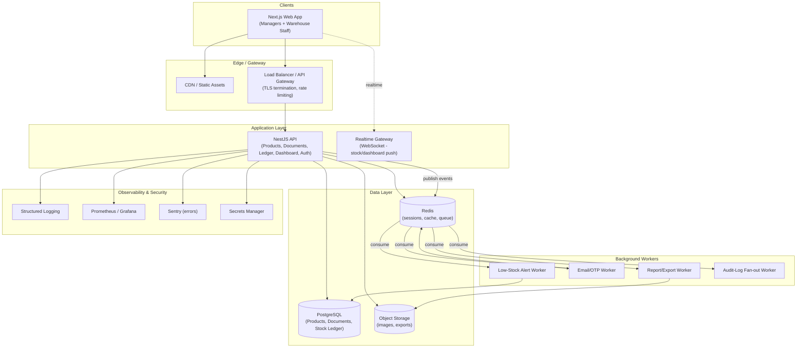

# StockSense — GitHub Research & Production System Architecture

*A production-grade Inventory Management System (receipts, delivery orders, internal transfers, adjustments, multi-warehouse, dashboard, OTP auth) — full repository research, architecture, and AI-agent implementation roadmap.*

---

## 1. Problem Understanding

StockSense is, functionally, a lean clone of the "Inventory" app inside Odoo/ERPNext: it is **not** a generic CRUD app — it is a **stateful, ledger-backed workflow engine**. The non-negotiable domain rules are:

- Every stock quantity change must originate from a **document** (Receipt, Delivery Order, Internal Transfer, Adjustment) that moves through a **status lifecycle**: `Draft → Waiting → Ready → Done` (or `Canceled`).
- Stock only actually changes **on validation** of a document, never on creation — this is the single most important invariant in the whole system.
- Every movement must be **appended to an immutable Stock Ledger** (audit trail), not just reflected in a mutable "current stock" number.
- Stock is tracked **per product × per location** (warehouse, and optionally bin/rack), not just per product — this is what makes Internal Transfers meaningful ("stock unchanged in total, but new location updated," exactly as in the spec).
- Concurrent validations (two staff validating receipts for the same SKU at once) must not corrupt stock counts — this is a concurrency/locking problem, not just a CRUD problem.
- Auth needs OTP-based password reset, not just email/password.
- Two roles with different permitted actions: Inventory Managers (full operational control) vs Warehouse Staff (execute transfers/picking/shelving/counting).

This reframes the project from "build a CRUD app with a dashboard" to **"build an event-sourced-ish, document-driven stock ledger with a dashboard on top."** That reframing drives every recommendation below: we deliberately steer away from repos that only do "products + orders" CRUD (there are dozens of these on GitHub, and I am filtering nearly all of them out) and toward repos that model the **document lifecycle + ledger** correctly, because that is the hard 20% of this build.

---

## 2. Top Production-Grade GitHub Repositories

I evaluated ~20+ candidates and am recommending a short list, deliberately excluding repos that are CRUD-only demos with no document lifecycle or ledger (most "Next.js + Prisma + MongoDB inventory" portfolio projects fall into this bucket, however polished their READMEs are — see §9 for why they were excluded).

| # | Repository | Category | Verdict |
|---|---|---|---|
| 1 | **frappe/erpnext** (`stock` module) | Mature ERP — inventory domain model | Reference architecture (not integrated directly) |
| 2 | **openboxes/openboxes** | Production WMS, healthcare-grade | Reference architecture + selected reusable ideas |
| 3 | **Kiranism/next-shadcn-dashboard-starter** | Production Next.js + shadcn admin shell | Directly integrable frontend foundation |
| 4 | **andrechristikan/ack-nestjs-boilerplate** | Production NestJS auth/RBAC/OTP boilerplate | Directly integrable backend auth foundation |
| 5 | **arnobt78/Warehouse-Stock-Inventory-Management-System--NextJS-FullStack** ("Stockly") | Full-stack Next.js/Prisma/Mongo inventory app | Reference only — UI/UX and schema ideas, not the write-path |
| 6 | **marmelab/shadcn-admin-kit** | Admin CRUD scaffolding kit on shadcn/ui | Optional accelerator for low-value CRUD screens (categories, UoM, users) |

### Why ERPNext and OpenBoxes anchor this list

ERPNext's stock module is the most battle-tested open-source implementation of exactly this domain: it centers on a **Stock Ledger Entry** as the immutable source of truth, uses a **Stock Entry / document-submission model** (draft → submitted, mirroring StockSense's Draft→Done), supports **hierarchical, tree-structured multi-warehouse locations**, computes running balances with FIFO/LIFO/moving-average valuation, and **auto-triggers reordering** (Material Requests) when stock crosses a reorder threshold<cite index="35-1,35-2">ERPNext supports multiple warehouses and even a hierarchy of warehouses, and each stock transaction updates a perpetual inventory ledger and can trigger reorder logic, with costing methods like FIFO, LIFO, or moving average for valuation</cite>. A community add-on for it also demonstrates exactly the low-stock alert pattern StockSense needs: <cite index="31-1">checking every stock movement against an item's reorder levels, opening a desk notification and a self-resolving Low Stock Alert record as stock drops and recovers</cite>. This confirms the domain model StockSense's PDF describes (reordering rules, auto low-stock alerts, ledger-logged internal transfers) is not a novel design — it is the standard pattern used by production ERPs, and ERPNext's Frappe/Python codebase is the best **reference implementation to read**, even though we will not run Frappe itself (too heavy/opinionated for a lean IMS — see §9).

OpenBoxes is a second, independently-built production WMS <cite index="12-1">designed to manage inventory and track stock movements for healthcare facilities, originally built after the 2010 Haiti earthquake and now running in healthcare facilities across multiple countries</cite>, which has since <cite index="12-1">evolved into a general-purpose warehouse management system used across a wide range of industries</cite>. Its value here is validating the **same document-lifecycle pattern** (receipts, shipments, internal transfers, stock counts) from a completely different, non-Odoo lineage — two independent production systems converging on the same core model is strong evidence this is the correct domain shape to replicate, not the specific code to reuse (both are Java/Groovy/Python monoliths, wrong stack for this build).

---

## 3. Repository-by-Repository Analysis

### 3.1 `frappe/erpnext` — stock module (reference only)
- **What it does**: Full ERP; the `stock` app covers items, warehouses, stock entries, valuation, reorder rules, batch/serial tracking, stock ledger reporting.
- **Solves**: The exact conceptual model of Products → Receipts/Deliveries/Transfers/Adjustments → Stock Ledger → Dashboard KPIs → Reorder alerts.
- **Reusable component**: Not code (Python/Frappe framework is too tightly coupled to be extracted cleanly) — reuse the **data model** and **state machine**: `Stock Ledger Entry` schema (item, warehouse, posting datetime, qty change, running balance, voucher type/no), the **submit-to-post** pattern, and the **warehouse-as-tree** structure.
- **Stack**: Python, Frappe framework, MariaDB, Redis.
- **Architecture**: Monolithic framework app; doctype-based ORM; server-side business logic hooks.
- **Production-readiness**: Very high — used by thousands of companies in production.
- **Maintenance**: Extremely active (large team, continuous releases).
- **Integration verdict**: **Reference/study only.** Do not fork or vendor Frappe — it's a full framework with its own ORM, permissions engine, and UI paradigm; adopting it would mean building StockSense *inside* ERPNext rather than as its own product. We port its *ledger and reorder concepts* into our own NestJS/Postgres schema instead.
- **Licensing**: GPLv3 — irrelevant since we're not copying code, only the conceptual model (models/ideas are not copyrightable; code would be).
- **What we still build**: Everything — our own schema, API, and UI implementing the same concepts.

### 3.2 `openboxes/openboxes`
- **What it does**: <cite index="12-1">General-purpose warehouse management system tracking inventory and stock movements</cite>, with receiving, shipping, internal transfers, and stock counts.
- **Solves**: Validates the document-lifecycle + ledger pattern from an independent lineage; also a good reference for **low-resource-environment reliability** design (it explicitly targets <cite index="12-1">running smoothly, reliably, and affordably in low-resource environments</cite>, which is a useful lens for keeping StockSense's infra lean).
- **Reusable component**: Conceptual only — its **event/transaction model** for stock movement and its **local/production deployment docs** structure are worth reading before writing our own runbooks.
- **Stack**: Groovy/Grails, JavaScript frontend, relational DB.
- **Architecture**: Monolithic Grails app.
- **Production-readiness**: High (multi-country healthcare deployments; has unit/integration test suites and a documented release process, visible in its repo badges).
- **Maintenance**: Active (regular releases, e.g. adjustment-transaction ordering fixes are actively landing).
- **Integration verdict**: **Reference only** — Grails/Groovy is the wrong stack for this build.
- **Licensing**: Eclipse Public License 1.0 — again irrelevant since we don't vendor code.
- **What we still build**: Everything.

### 3.3 `Kiranism/next-shadcn-dashboard-starter`
- **What it does**: <cite index="40-1">A free, open-source, AI-friendly admin dashboard template built with Next.js 16, shadcn/ui, Tailwind CSS, and TypeScript, with production-ready tables, forms, auth, and billing</cite>.
- **Solves**: The entire **Dashboard/Navigation/Products-table/Filters shell** of StockSense — sidebar navigation, KPI cards, dynamic filters, data tables — is exactly this template's job.
- **Reusable component**: <cite index="40-1">Its data layer follows the official TanStack Query SSR pattern (server prefetch + HydrationBoundary + useSuspenseQuery), typed end to end, organized feature-by-feature with a clean API layer per feature</cite>, plus <cite index="41-1">a pre-built admin layout (sidebar, header, content area), data tables with search/filter/pagination, and a feature-based folder structure</cite> we adopt directly for `frontend/`.
- **Stack**: Next.js (App Router), TypeScript, shadcn/ui, Tailwind, TanStack Table/Query, React Hook Form + Zod.
- **Architecture**: Feature-sliced Next.js app (`features/<domain>/{api,components,schemas}`).
- **Production-readiness**: High — <cite index="40-1">explicitly built so every feature is a working, production-ready implementation rather than static demo UI, with tables that really search/filter/sort/paginate and forms that really validate and mutate with cache invalidation</cite>.
- **Maintenance**: Active, current on Next.js 16/React 19.
- **Integration verdict**: **Directly integrate** as the frontend scaffold. Strip its default Clerk billing/org features (not needed for an internal IMS), keep the layout shell, table/filter patterns, and TanStack Query wiring, and point the API layer at our own NestJS backend instead of its demo API.
- **Licensing**: MIT — safe for direct commercial reuse and modification.
- **What we still build**: All StockSense-specific screens (Receipts, Delivery Orders, Transfers, Adjustments, Stock Ledger view, Warehouse settings) using the starter's patterns as the template.

### 3.4 `andrechristikan/ack-nestjs-boilerplate`
- **What it does**: <cite index="23-1">A NestJS v11 boilerplate with JWT, OAuth (Google & Apple), OTP, TOTP/2FA, and RBAC, using the Repository Design Pattern, modular, production-ready, and database-agnostic via Prisma</cite>.
- **Solves**: The entire **Authentication** requirement — signup/login, OTP-based password reset, role-based access (Inventory Manager vs Warehouse Staff) — out of the box.
- **Reusable component**: OTP module, JWT access/refresh flow, RBAC guards/decorators, and its <cite index="23-1">Sentry-based logging and activity-log system</cite> for audit trails (useful since every stock action needs an audit trail anyway).
- **Stack**: NestJS, Prisma ORM (DB-agnostic — we target PostgreSQL), Redis (for stateful/session-backed auth), Sentry.
- **Architecture**: Modular NestJS app, repository pattern, decorator-driven guards (it documents a strict <cite index="23-1">decorator-ordering convention across auth/role/feature-flag/API-key guards</cite> worth adopting verbatim for consistency).
- **Production-readiness**: High — explicitly production-ready with documented security posture (ES256 JWTs, optional Vault integration for secrets).
- **Maintenance**: Active.
- **Integration verdict**: **Directly integrate** the `auth`, `user`, and `policy/role` modules into our NestJS backend as the `modules/auth` and `modules/rbac` packages. Simpler alternative if the full ACK boilerplate is too heavy: `jaleeldgk/nestjs-auth`, a smaller <cite index="24-1">production-ready authentication starter with JWT, Prisma, and Nodemailer including email verification via OTP, password reset via OTP, RBAC, rate limiting, and Helmet security headers</cite> — a good fallback if the team wants a slimmer starting point.
- **Licensing**: MIT-style (verify exact license file at integration time) — safe for reuse.
- **What we still build**: Domain-specific permission matrix (which of the two StockSense roles can validate which document types), wiring auth into our own Product/Warehouse/Document modules.

### 3.5 `arnobt78/Warehouse-Stock-Inventory-Management-System--NextJS-FullStack` ("Stockly")
- **What it does**: <cite index="3-1">A full-stack warehouse and stock inventory management system built with Next.js, React, Prisma, and MongoDB, helping store owners, suppliers, and clients manage products, orders, invoices, warehouses, and support tickets with role-based access, analytics dashboards, QR codes, Stripe payments, Shippo shipping, and Brevo email</cite>.
- **Solves**: Partial UI/UX inspiration for the Products screen, QR-code-per-SKU idea, and warehouse CRUD screens.
- **Reusable component**: <cite index="3-1">Its reusable `components/ui`, validation schemas, and query-invalidation helper patterns</cite> — genuinely nice small utilities — but **not** its core write-path, because it models stock as a **mutable field on Product** (`quantity++`/`quantity--` via patch requests) rather than a **document → ledger** pipeline. That is the exact anti-pattern StockSense's spec explicitly rejects (Odoo-style validate-to-mutate, ledger-logged).
- **Stack**: Next.js 16, React 19, Prisma/MongoDB, JWT, TanStack Query, optional Redis, Stripe/Shippo/Brevo/Sentry integrations.
- **Architecture**: `app/api` route handlers + `hooks/queries` + `lib/server`, described by its own author as <cite index="3-1">teaching-oriented and production-shaped rather than a strict production system</cite>.
- **Production-readiness**: Medium — good code hygiene, but the domain model (mutable stock field, no document lifecycle, no immutable ledger) is not sufficient for StockSense's core requirement.
- **Maintenance**: Active, recently built.
- **Integration verdict**: **Reference/component-harvest only** — pull specific UI components (QR generation, category/supplier CRUD forms) but rebuild the stock-mutation logic from scratch on our ledger model.
- **Licensing**: MIT (typical for these portfolio-grade repos — verify at integration time).
- **What we still build**: The entire document/ledger write path; this repo does not solve that part.

### 3.6 `marmelab/shadcn-admin-kit` (optional accelerator)
- **What it does**: <cite index="46-1">A component kit for building admin apps with shadcn/ui — data tables with sorting/filtering/export/bulk actions/column selection, form components with data binding and validation, sidebar menu, login/auth-check/access-control compatible with any auth backend, a dashboard page, and scaffolding from an API response via Guessers</cite>, built on `ra-core` (React-admin's headless core).
- **Solves**: Low-value, high-volume CRUD screens: Product Categories, Units of Measure, Warehouse master data, User management — places where hand-building forms is wasted effort.
- **Reusable component**: The Guesser-based scaffolding for fast CRUD, and its generic list/edit/create pattern.
- **Stack**: React, shadcn/ui, Base UI, Tailwind, React Router, TanStack Query, ra-core.
- **Production-readiness**: Medium-high; younger project riding on the mature `ra-core`/react-admin lineage.
- **Integration verdict**: **Optional** — use only for the low-stakes settings/master-data screens if the team wants to save time there; do **not** use it for Receipts/Deliveries/Transfers/Adjustments, which need custom multi-step, stateful wizards that a generic CRUD Guesser cannot model correctly.
- **Licensing**: MIT.
- **What we still build**: All workflow screens.

---

## 4. Requirement → Repository Mapping

| Problem Requirement | Existing Repository | Reusable Component | Modification Required |
|---|---|---|---|
| Signup/login | `ack-nestjs-boilerplate` | JWT auth module, guards | Wire to our User/Role schema |
| OTP password reset | `ack-nestjs-boilerplate` (or `jaleeldgk/nestjs-auth`) | OTP generation/verification service, mailer | Point at transactional email provider; add SMS OTP if required later |
| Role-based access (Manager vs Staff) | `ack-nestjs-boilerplate` | RBAC decorators/guards, policy module | Define StockSense's 2-role × document-action permission matrix |
| Dashboard shell + KPI cards + nav | `next-shadcn-dashboard-starter` | Layout, sidebar, card components, Recharts wiring | Replace demo data with `/dashboard/kpis` API |
| Dynamic filters (doc type/status/warehouse/category) | `next-shadcn-dashboard-starter` | TanStack Table + nuqs URL-state filter pattern | Bind filters to our document-query API params |
| Product CRUD (name/SKU/category/UoM/initial stock) | `shadcn-admin-kit` *or* hand-built forms from the dashboard starter | Guesser CRUD / RHF+Zod form patterns | Add SKU auto-generation, category tree, reorder-rule fields |
| Stock availability per location | ERPNext stock model (concept) | — (concept, not code) | Build `stock_balance` materialized view keyed by (product, location) |
| Reordering rules / low-stock alerts | ERPNext + `inventory-hub` add-on (concept) | — (concept: check-on-movement + self-resolving alert record) | Build our own reorder-check triggered on every ledger write |
| Receipts (incoming stock) | ERPNext / OpenBoxes (concept: document → submit → ledger) | — (concept only) | Build `documents` + `document_lines` + state machine + validate transaction |
| Delivery Orders (outgoing stock, pick→pack→validate) | ERPNext / OpenBoxes (concept) | — | Same document engine, `type=delivery`, decrement direction |
| Internal Transfers (location→location, stock unchanged in total) | ERPNext (concept: from_location/to_location on one ledger entry) | — | Same document engine, dual-location ledger entries |
| Stock Adjustments (recount → auto-log delta) | ERPNext Stock Reconciliation (concept) | — | `type=adjustment`, compute delta = counted − system, write ledger |
| Move History / Stock Ledger | ERPNext Stock Ledger Entry (concept) | — | Our own append-only `stock_ledger` table, indexed by product+location+time |
| Multi-warehouse support | ERPNext warehouse tree (concept) | — | `locations` table with optional parent_id for bin/rack hierarchy |
| SKU search & smart filters | `next-shadcn-dashboard-starter` table search | Search input + debounce pattern | Wire to Postgres full-text/trigram index on SKU/name |
| Auth session & security headers | `ack-nestjs-boilerplate` | Helmet, rate limiting, refresh-token rotation | Tune for our deployment |

**Net effect of reuse**: the entire **frontend shell** (~30–40% of total UI effort) and the entire **auth/RBAC layer** (~90% of that subsystem) come from directly-integrated, MIT-licensed repositories. The **core inventory domain engine — documents, state machine, ledger, concurrency-safe stock math** — has no safely reusable off-the-shelf code in the right stack, so it is built from scratch, informed by ERPNext's and OpenBoxes' proven data model. This is the correct split: reuse commodity infrastructure, hand-build the domain logic that *is* the product.

---

## 5. Recommended Technology Stack

| Layer | Choice | Why |
|---|---|---|
| Frontend | Next.js 15+ (App Router), TypeScript, shadcn/ui, Tailwind, TanStack Table/Query, React Hook Form + Zod | Directly matches `next-shadcn-dashboard-starter`'s stack — zero translation cost |
| Backend/API | NestJS (TypeScript), REST (OpenAPI/Swagger) | Matches `ack-nestjs-boilerplate`; Nest's modular DI is a natural fit for domain modules (Products, Documents, Ledger, Auth) |
| Database | PostgreSQL | ACID transactions are mandatory for ledger correctness; row-level locking (`SELECT ... FOR UPDATE`) needed for concurrent stock validation |
| ORM | Prisma | Matches both harvested boilerplates; typed schema, migrations |
| Cache | Redis | Session/refresh-token store, dashboard KPI cache, rate limiting |
| Queue / events | Redis Streams or BullMQ (small-to-mid scale) → RabbitMQ if scaling out workers | Async low-stock alert evaluation, email/OTP sending, audit-log fan-out |
| Auth | JWT access + refresh tokens, OTP via email (SMS optional later) | From `ack-nestjs-boilerplate` |
| Realtime | WebSocket (Socket.IO) or Server-Sent Events for dashboard KPI/stock updates | Optional Phase 2; Supabase-Realtime-style push seen in `Stock_Master` reference confirms this is a common, expected UX pattern for this domain |
| File/object storage | S3-compatible (AWS S3 / MinIO for self-host) | Product images, adjustment photos, exported reports |
| Search | Postgres `pg_trgm` (SKU/name fuzzy search) initially; OpenSearch only if scale demands it | Avoid overbuilding search infra prematurely |
| Observability | OpenTelemetry → Prometheus + Grafana; Sentry for error tracking | Matches ACK boilerplate's Sentry integration |
| CI/CD | GitHub Actions | Matches ecosystem of both harvested repos |
| Containerization | Docker + docker-compose (dev), Kubernetes (prod) or a single managed container platform for MVP | Right-sized: don't over-engineer K8s for an MVP with 2 user roles |
| IaC | Terraform | Reproducible infra for staging/prod parity |

---

## 6. Complete Production System Architecture



**Component responsibilities**

- **Next.js Web App** — server-rendered dashboard/nav shell (from the shadcn starter), client mutations via TanStack Query hitting the NestJS API. Role-aware UI: Warehouse Staff see Operations (Receipts/Deliveries/Transfers/Adjustments execution) + Move History; Inventory Managers additionally see Products, Settings, full Dashboard KPIs.
- **NestJS API** — modular monolith at MVP stage (`modules/auth`, `modules/products`, `modules/warehouses`, `modules/documents`, `modules/ledger`, `modules/dashboard`). Each `Document` validation runs inside a **single DB transaction** that (a) locks the affected `(product, location)` stock rows, (b) writes ledger entries, (c) updates the `document.status`, (d) publishes a `stock.changed` event for the low-stock worker and realtime gateway. This transactional boundary is the single most important piece of the whole backend.
- **Realtime Gateway** — pushes dashboard KPI deltas and stock-ledger updates to connected clients so managers see receipts/deliveries land live, mirroring the realtime UX pattern seen in comparable community projects.
- **Background Workers** — decoupled via a queue so that OTP email delivery, low-stock evaluation, and report generation never block the synchronous validate-a-document request path.
- **PostgreSQL** — single source of truth; strong consistency is required because "stock count" is a financial/operational fact, not eventually-consistent analytics.
- **Redis** — sessions/refresh tokens (from the auth boilerplate's pattern), short-TTL dashboard KPI cache, and the job queue.
- **Object Storage** — product images and generated reports/exports (CSV/PDF of Move History).

**Security layer**: JWT access (short-lived) + refresh-token rotation (from `ack-nestjs-boilerplate`), RBAC guards on every mutating endpoint, Helmet security headers, per-IP + per-user rate limiting (critical on OTP endpoints specifically, to prevent OTP brute-force), input validation via Zod (frontend) and class-validator (NestJS DTOs), audit log of every state-changing action (who validated which document, when), secrets pulled from a vault/secret manager rather than `.env` in production.

---

## 7. Detailed Project/Folder Structure

```text
stocksense/
├── frontend/                          # Next.js app — from next-shadcn-dashboard-starter
│   ├── app/
│   │   ├── (auth)/                    # login, signup, forgot-password, verify-otp
│   │   ├── (dashboard)/
│   │   │   ├── dashboard/             # KPI cards + filters (starter's layout, our data)
│   │   │   ├── products/
│   │   │   ├── receipts/
│   │   │   ├── deliveries/
│   │   │   ├── transfers/
│   │   │   ├── adjustments/
│   │   │   ├── move-history/
│   │   │   └── settings/warehouses/
│   ├── features/                      # feature-sliced, mirrors starter's pattern
│   │   ├── auth/{api,components,schemas}
│   │   ├── products/{api,components,schemas}
│   │   ├── documents/{api,components,schemas}   # shared doc-wizard UI (receipts/deliveries/transfers/adjustments)
│   │   └── dashboard/{api,components}
│   ├── components/ui/                 # shadcn/ui primitives (harvested as-is)
│   └── lib/                           # api client, query client, auth helpers
│
├── backend/                           # NestJS modular monolith
│   ├── src/
│   │   ├── modules/
│   │   │   ├── auth/                  # harvested from ack-nestjs-boilerplate: jwt, otp, rbac
│   │   │   ├── users/
│   │   │   ├── products/              # products, categories, UoM, reorder rules
│   │   │   ├── warehouses/            # locations tree (warehouse/rack/bin)
│   │   │   ├── documents/             # receipts/deliveries/transfers/adjustments engine
│   │   │   │   ├── documents.service.ts     # state machine (Draft→Waiting→Ready→Done/Canceled)
│   │   │   │   ├── validate-document.tx.ts  # the critical transactional stock-mutation logic
│   │   │   ├── ledger/                # append-only stock_ledger writes + balance queries
│   │   │   ├── dashboard/             # KPI aggregation endpoints
│   │   │   └── notifications/         # low-stock alerts, OTP email dispatch
│   │   ├── common/                    # guards, interceptors, filters, decorators
│   │   ├── config/                    # env schema/validation
│   │   └── main.ts
│   ├── prisma/schema.prisma
│   └── test/                          # unit + e2e (Jest, Supertest)
│
├── workers/                           # BullMQ processors, separate deployable
│   ├── low-stock-alert.worker.ts
│   ├── email-otp.worker.ts
│   └── report-export.worker.ts
│
├── infrastructure/                    # Terraform (VPC, DB, Redis, object storage, K8s/ECS)
├── docker/                            # Dockerfiles per service + docker-compose.yml (dev)
├── database/                          # SQL seed scripts, ledger schema docs, ERD
├── .github/workflows/                 # ci.yml, deploy-staging.yml, deploy-prod.yml
├── tests/e2e/                         # Playwright end-to-end flows (receipt→ledger→dashboard)
├── docs/                              # ADRs, API docs (OpenAPI), runbooks
├── scripts/                           # db migrate/seed, local bootstrap
└── configs/                           # shared eslint/prettier/tsconfig
```

**Per-directory sourcing**

- `frontend/` — **80% harvested** from `next-shadcn-dashboard-starter` (layout, table/filter patterns, form patterns); **20% built** (all StockSense-specific screens and the shared multi-step "document wizard" component used by Receipts/Deliveries/Transfers/Adjustments).
- `backend/src/modules/auth` — **70% harvested** from `ack-nestjs-boilerplate`; **30% built** (StockSense's specific 2-role permission matrix).
- `backend/src/modules/documents` + `ledger` — **100% built from scratch**, informed by ERPNext/OpenBoxes' data model. This is correctly the largest, highest-craft part of the codebase.
- `workers/` — pattern harvested conceptually from the ACK boilerplate's async notification design; implementation is ours.
- `infrastructure/`, `docker/`, `.github/workflows/` — built from scratch using standard, well-known patterns (Terraform + GH Actions), not copied from any single repo.

---

## 8. Repository Integration Strategy

**Reuse → Adapt → Build, explicitly:**

1. **Reuse as-is (MIT-licensed, safe to fork and rebrand)**
   - `next-shadcn-dashboard-starter`: fork it, run its documented cleanup script to strip unused demo features (billing, org switcher), keep layout/table/query wiring.
   - `ack-nestjs-boilerplate`'s `auth` + `user` modules: copy the module folders into `backend/src/modules/`, keep the OTP/JWT/RBAC logic intact.

2. **Adapt (concept ported, code rewritten in our stack)**
   - ERPNext's Stock Ledger Entry model → our `stock_ledger` Prisma model.
   - ERPNext's reorder-rule + alert pattern → our `notifications` module reorder check, running as a worker instead of a synchronous framework hook.
   - OpenBoxes' document-transaction ordering safeguards (their own changelog explicitly calls out forcing adjustment transactions to always post *after* the corresponding product-inventory transaction) → we enforce equivalent ordering guarantees via DB transaction + row locks rather than an application-level ordering flag.

3. **Build from scratch**
   - The `documents` state machine and its validation transaction — the single most important, highest-risk piece of code in the system.
   - The dashboard KPI aggregation queries.
   - Realtime gateway.
   - Infra/CI/CD.

**Standardization rules across the merged codebase** (to avoid the "Frankenstein" outcome explicitly warned against in the brief):

- One linting/formatting config (`configs/`) applied to both harvested repos after import — do not keep two different ESLint configs.
- One API contract style: OpenAPI-documented REST, `camelCase` JSON, consistent error envelope `{ error: { code, message, details } }` — rewrite the harvested boilerplate's error format to match if it differs.
- One auth token shape end-to-end — the frontend starter's demo used Clerk; that is removed entirely and replaced with the NestJS JWT flow from the auth boilerplate, so there is exactly one auth system, not two competing ones.
- Remove all unrelated dependencies pulled in by harvested repos (Stripe/Shippo/Brevo from Stockly-style references, Clerk/billing from the dashboard starter) — StockSense needs none of them.
- Every ledger-writing code path goes through one function (`ledger.append()`), never ad-hoc `UPDATE stock_balance` statements, so there is one place that guarantees the audit trail is never bypassed.

---

## 9. Build-vs-Reuse Analysis

| Component | Decision | Rationale |
|---|---|---|
| Auth/OTP/RBAC | **Reuse** (ack-nestjs-boilerplate) | Commodity problem, solved well, MIT-licensed |
| Admin dashboard shell/UI kit | **Reuse** (shadcn dashboard starter) | Commodity problem, saves weeks of UI plumbing |
| Product/Category/UoM CRUD screens | **Reuse/Adapt** (shadcn-admin-kit Guessers or starter's form patterns) | Low-risk CRUD, not core differentiator |
| Document lifecycle engine (Receipts/Deliveries/Transfers/Adjustments) | **Build** | This *is* the product; no safe off-the-shelf implementation exists in our stack; concurrency correctness is paramount |
| Stock Ledger | **Build** (concept adapted from ERPNext) | Must be tailor-fit to our schema and transaction boundaries |
| Reorder/low-stock alerting | **Build** (concept adapted from ERPNext + community add-on pattern) | Small, but must integrate with our own event pipeline |
| Full ERP (ERPNext/OpenBoxes themselves) | **Reject as base** | Wrong stack, far too heavy (accounting, manufacturing, HR modules we don't need), would take longer to strip down than to build StockSense natively |
| Generic "inventory" Next.js/Prisma portfolio clones (Stockly-style) | **Reject as base, harvest components only** | Model stock as a mutable field with no document lifecycle or immutable ledger — the exact anti-pattern the spec rejects |

---

## 10. Security Architecture

- **AuthN**: email+password signup/login; OTP (6-digit, 5–10 min TTL, rate-limited attempts) for password reset, delivered via transactional email provider (SendGrid/SES/Postmark).
- **AuthZ**: RBAC with two roles (`INVENTORY_MANAGER`, `WAREHOUSE_STAFF`) mapped to a permission matrix on document types/actions (e.g., Staff can execute pick/pack/validate on assigned documents; only Managers can create Adjustments or edit Product master data or Warehouse settings).
- **Transport**: TLS everywhere; HSTS; Helmet-set security headers (from the auth boilerplate).
- **Tokens**: short-lived JWT access tokens (~15 min), rotating refresh tokens stored httpOnly/secure cookies, refresh-token reuse detection (revoke family on reuse).
- **Secrets**: environment-injected via a secrets manager (Vault/AWS Secrets Manager), never committed; DB credentials rotated.
- **Input validation**: class-validator DTOs on every NestJS endpoint; Zod schemas mirrored on the frontend.
- **Rate limiting**: global + endpoint-specific (tight limits on `/auth/otp/*`).
- **Audit trail**: every document status transition and ledger write records `actorId`, `timestamp`, `ipAddress` — this also directly satisfies "Move History" as a product feature.
- **Data integrity**: DB-level `CHECK` constraints (no negative stock unless explicitly allowed for backorder scenarios), foreign-key constraints across documents ↔ ledger.
- **Dependency hygiene**: automated dependency scanning (Dependabot/Snyk) in CI given the amount of harvested third-party code.

---

## 11. Database Architecture

Core tables (PostgreSQL, via Prisma):

```
users(id, email, password_hash, role, is_active, created_at)
otp_codes(id, user_id, code_hash, purpose, expires_at, consumed_at)

products(id, sku, name, category_id, uom_id, reorder_point, reorder_qty, created_at)
categories(id, name, parent_id)
units_of_measure(id, code, name)

locations(id, name, type[WAREHOUSE|ZONE|RACK|BIN], parent_id)

documents(id, type[RECEIPT|DELIVERY|TRANSFER|ADJUSTMENT], status[DRAFT|WAITING|READY|DONE|CANCELED],
          source_location_id, dest_location_id, partner_ref, created_by, validated_by, validated_at)
document_lines(id, document_id, product_id, expected_qty, actual_qty)

stock_ledger(id, product_id, location_id, document_id, qty_delta, balance_after,
             posted_at, actor_id)                              -- append-only, never UPDATE/DELETE

stock_balances(product_id, location_id, quantity, updated_at)  -- materialized/derived cache of stock_ledger
                                                                  for fast dashboard reads; rebuildable from ledger
```

- **Why both `stock_ledger` and `stock_balances`**: the ledger is the immutable source of truth (append-only, auditable, matches "Move History" and "Everything logged in the Stock Ledger" from the spec); `stock_balances` is a derived, indexed read-model kept in sync **inside the same transaction** as the ledger write, so dashboard queries ("Total Products in Stock," "Low Stock items") stay O(1) lookups instead of aggregating the whole ledger on every page load.
- **Concurrency control**: validating a document takes `SELECT ... FOR UPDATE` locks on the affected `stock_balances` rows before writing, preventing two simultaneous validations on the same product/location from double-counting.
- **Internal transfers** write **two** ledger rows in one transaction (negative delta at source, positive delta at destination) so the ledger always nets to zero for a transfer, matching "stock unchanged in total, but new location updated."
- **Indexes**: composite index on `stock_ledger(product_id, location_id, posted_at)`; trigram index on `products(sku, name)` for smart search; index on `documents(status, type, created_at)` for the dashboard filters.
- **Migrations**: Prisma Migrate, versioned in `database/`, reviewed in CI.

---

## 12. API Architecture

- **Style**: REST, OpenAPI/Swagger auto-generated from NestJS decorators (matches the harvested auth boilerplate's convention).
- **Versioning**: `/api/v1/...` prefix from day one.
- **Key endpoint groups**:
  - `POST /auth/signup`, `POST /auth/login`, `POST /auth/otp/request`, `POST /auth/otp/verify-reset`
  - `GET/POST/PATCH /products`, `/categories`, `/uoms`
  - `GET/POST /warehouses` (locations tree)
  - `POST /documents` (create draft), `PATCH /documents/:id` (edit lines, transition status), `POST /documents/:id/validate` (the critical transactional endpoint)
  - `GET /ledger?product=&location=&from=&to=` (Move History)
  - `GET /dashboard/kpis`, `GET /dashboard/filters-metadata`
- **Idempotency**: `POST /documents/:id/validate` accepts an idempotency key to safely handle double-submits from flaky warehouse-floor networks.
- **Realtime channel**: `ws://.../dashboard` emits `stock.changed`, `document.status_changed`, `alert.low_stock` events.
- **Error contract**: consistent `{ error: { code, message, fieldErrors? } }` across the whole API, enforced by a global NestJS exception filter.

---

## 13. Deployment Architecture

- **Environments**: local (docker-compose) → staging → production, with Terraform-managed parity.
- **Compute**: containerized NestJS API + workers on ECS/Cloud Run/Kubernetes (pick based on team's existing ops maturity; Kubernetes is justified once you need per-service autoscaling for workers separately from the API — not required at MVP scale).
- **Database**: managed Postgres (RDS/Cloud SQL) with automated backups + point-in-time recovery (mandatory given the ledger is financially/operationally authoritative).
- **Cache/Queue**: managed Redis (ElastiCache/Upstash).
- **Frontend**: Next.js deployed to Vercel or containerized behind the same load balancer as the API.
- **CDN**: static assets + images.
- **Blue/green or rolling deploys** for the API to avoid downtime during document-validation traffic.
- **Feature flags**: for staged rollout of realtime dashboard push and any Phase-2 features (barcode scanning, mobile app).

---

## 14. Testing Strategy

- **Unit tests** (Jest): document state-machine transitions, ledger math (especially transfer's dual-entry logic and adjustment delta calculation), reorder-rule evaluation.
- **Integration tests**: document validation endpoint against a real test Postgres instance (Testcontainers), asserting ledger rows + balance updates are correct and atomic.
- **Concurrency tests**: simulate two simultaneous validations against the same product/location to prove row-locking prevents double-counting — this is the single highest-value test in the whole suite given the spec's warehouse-staff-concurrent-use context.
- **Contract tests**: OpenAPI schema validated in CI so frontend and backend never silently drift.
- **E2E tests** (Playwright): the exact flow from the spec — receive 100kg steel → internal transfer → deliver 20 → adjust −3 damaged → assert ledger and dashboard KPIs match expected values at each step.
- **Frontend component tests** (Vitest/RTL) for the document wizard and dashboard filter components inherited from the starter.
- **Security tests**: OTP brute-force rate-limit test, RBAC boundary tests (Warehouse Staff attempting a Manager-only action must be rejected).

---

## 15. Observability Strategy

- **Logging**: structured JSON logs (pino/winston) with correlation/request IDs threaded through API → workers.
- **Metrics**: Prometheus counters/histograms for document-validation latency, ledger-write throughput, OTP request rate, queue depth; Grafana dashboards mirroring the product's own KPI dashboard for ops visibility.
- **Tracing**: OpenTelemetry spans across API → DB → queue → worker, so a slow "validate receipt" call can be root-caused.
- **Error tracking**: Sentry (already a first-class citizen of the harvested auth boilerplate).
- **Alerting**: PagerDuty/Slack alerts on elevated 5xx rate, queue backlog growth, DB connection saturation, and — as a business-level alert, not just an infra one — a spike in `alert.low_stock` events.
- **Audit dashboard**: internal admin view over the `stock_ledger` and document audit fields for compliance/support use, distinct from the customer-facing Move History screen.

---

## 16. Antigravity Implementation Roadmap

Each phase below is scoped for an AI coding agent (Antigravity) to execute sequentially, with explicit completion criteria so progress is verifiable without human guesswork at every step.

### Phase 1 — Repository Initialization
- **Create**: monorepo root, `frontend/`, `backend/`, `workers/`, `infrastructure/`, `docker/`, `.github/`, `docs/`, `configs/` per §7.
- **Reuse**: fork `next-shadcn-dashboard-starter` into `frontend/`; fork the `auth`/`user` modules of `ack-nestjs-boilerplate` into `backend/src/modules/`.
- **New code**: root `package.json` workspaces config, shared `configs/` (ESLint/Prettier/tsconfig) applied to both.
- **Dependencies**: Node LTS, pnpm workspaces.
- **Tests**: CI pipeline runs `lint` + `typecheck` on empty scaffold successfully.
- **Completion criteria**: `pnpm install && pnpm build` succeeds across all packages; CI green on a trivial commit.

### Phase 2 — Infrastructure Setup
- **Create**: `docker-compose.yml` (Postgres, Redis, API, frontend, MinIO for local S3), `infrastructure/` Terraform skeleton (VPC, DB, Redis, object storage modules).
- **New code**: env-schema validation module in NestJS (`config/`).
- **Completion criteria**: `docker-compose up` boots Postgres/Redis/MinIO and an empty NestJS "hello" endpoint reachable at `/api/v1/health`.

### Phase 3 — Database Implementation
- **Create**: `backend/prisma/schema.prisma` with the full model from §11.
- **Reuse**: ERPNext-derived ledger shape as the schema blueprint (concept only).
- **Tests**: migration up/down tests; seed script creating demo products/warehouses.
- **Completion criteria**: `prisma migrate dev` runs cleanly; seed populates a runnable demo dataset matching the PDF's steel-rod example.

### Phase 4 — Backend Core Services (Products, Warehouses)
- **Create**: `modules/products`, `modules/warehouses`, `modules/categories`.
- **New code**: CRUD services/controllers, reorder-rule fields, SKU uniqueness validation.
- **Tests**: unit tests for validation rules; integration tests for CRUD endpoints.
- **Completion criteria**: full CRUD verified via Swagger UI + integration test suite passing.

### Phase 5 — Core Business Logic (Document Engine + Ledger)
- **Create**: `modules/documents` (state machine), `modules/ledger`.
- **New code**: `validate-document.tx.ts` — the transactional validation logic for all four document types, including the dual-entry transfer logic and adjustment delta logic.
- **Tests**: the concurrency test described in §14 is **mandatory** here, not deferred.
- **Completion criteria**: the PDF's full example sequence (receive 100kg → transfer → deliver 20 → adjust −3) reproduced end-to-end via API calls, with `stock_ledger` and `stock_balances` matching expected values at every step.

### Phase 6 — AI/ML Integration (optional, Phase-2 scope)
- Not required for MVP per the PDF; flagged here only if the team later wants demand-forecasting-driven reorder suggestions. Out of scope for the initial build — do not implement in Phase 1 MVP.

### Phase 7 — Frontend
- **Create**: all screens under §7's `frontend/app/(dashboard)/...`.
- **Reuse**: starter's layout/table/filter components as-is.
- **New code**: shared multi-step "document wizard" component (`features/documents/`) used across Receipts/Deliveries/Transfers/Adjustments; Dashboard KPI cards wired to `/dashboard/kpis`.
- **Tests**: Vitest/RTL component tests; Playwright smoke test of the login → dashboard flow.
- **Completion criteria**: a manager can log in and see live KPI cards reflecting seeded data.

### Phase 8 — External Integrations
- Transactional email provider for OTP delivery; object storage wiring for product images/exports.
- **Completion criteria**: OTP email actually arrives in a test inbox in staging.

### Phase 9 — Authentication/Security
- **Create**: wire RBAC permission matrix (Manager vs Staff) into every mutating endpoint and into frontend route guards.
- **Tests**: RBAC boundary tests, OTP rate-limit tests.
- **Completion criteria**: a Staff-role user is provably blocked from Manager-only actions in both API (403) and UI (hidden/disabled).

### Phase 10 — Testing (consolidation pass)
- Fill remaining unit/integration/E2E coverage gaps identified in earlier phases; target meaningful coverage on `modules/documents` and `modules/ledger` specifically (these carry the highest risk).
- **Completion criteria**: CI coverage report shows the ledger/document modules above the team's agreed threshold; full E2E suite green.

### Phase 11 — Observability
- Wire OpenTelemetry, Prometheus metrics, Sentry, structured logging per §15.
- **Completion criteria**: a deliberately-triggered error in staging appears in Sentry within seconds; a Grafana dashboard shows live document-validation latency.

### Phase 12 — Docker/Containerization
- Production Dockerfiles (multi-stage builds) for `frontend`, `backend`, `workers`.
- **Completion criteria**: `docker build` produces minimal, non-root, production images; `docker-compose -f docker-compose.prod.yml up` runs the full stack locally.

### Phase 13 — CI/CD
- **Create**: `.github/workflows/ci.yml` (lint/typecheck/test/build on every PR), `deploy-staging.yml`, `deploy-prod.yml` (manual-approval gate).
- **Completion criteria**: a merged PR auto-deploys to staging; production deploy requires explicit approval and succeeds.

### Phase 14 — Production Deployment
- Apply Terraform to provision production infra; run initial migration; smoke-test.
- **Completion criteria**: production `/health` green; synthetic monitoring confirms login → create receipt → validate → dashboard-KPI-updates round trip works in prod.

### Phase 15 — End-to-End Validation
- Full run-through of every scenario in the PDF's "Simplified Example to Understand Inventory Flow" against the live production (or prod-mirrored staging) environment, with sign-off checklist.
- **Completion criteria**: all four document types validated end-to-end by a real user in each role, ledger entries and dashboard KPIs verified correct, audit trail confirmed complete.

---

## 17. Final Recommended Architecture (Summary)

**Reuse the commodity 60%, hand-build the differentiated 40%:**

- **Frontend shell, tables, filters, forms** → forked from `next-shadcn-dashboard-starter` (MIT).
- **Auth, OTP, RBAC** → forked from `ack-nestjs-boilerplate` (production-grade, MIT-style).
- **Domain model inspiration** (ledger, warehouse hierarchy, reorder rules) → studied from `frappe/erpnext` and `openboxes/openboxes` (concepts only, not code — different stacks, different licenses, and the framework coupling makes direct code reuse impractical anyway).
- **The document-lifecycle engine and stock ledger itself** → built from scratch in NestJS + PostgreSQL with explicit transaction boundaries and row-level locking, because this is the one part of the system where correctness cannot be inherited from a UI kit or auth boilerplate — it has to be designed deliberately for StockSense's exact rules (validate-to-mutate, ledger-append-only, transfer nets to zero, concurrent-safe).
- **Everything else** (infra, CI/CD, observability, deployment) built using standard, well-understood patterns rather than copied wholesale from any single reference repo.

This gives a system that is fast to bootstrap (thanks to two solid, actively-maintained, permissively-licensed foundations), correct where it matters most (a purpose-built, tested, concurrency-safe ledger engine), and free of the "Frankenstein" risk the brief explicitly asked to avoid, because the two harvested repos overlap in stack (TypeScript, Prisma-compatible, Next.js/NestJS ecosystem) and are unified under one lint config, one auth system, and one API contract from Phase 1 onward.

---

*Research current as of September 2026. Star counts and maintenance activity should be re-verified at project kickoff, as GitHub repo activity can shift; the architectural reasoning above does not depend on point-in-time popularity, per the "don't prioritize by stars" instruction.*
