# StockSense Entity-Relationship Diagram (ERD)

This document provides a visual and relational specification of the PostgreSQL database schema for **StockSense**, matching `architecture.md` Section 11 and implemented via Prisma (`backend/prisma/schema.prisma`).

## Visual Entity-Relationship Diagram

```mermaid
erDiagram
    users ||--o{ otp_codes : "has"
    users ||--o{ documents : "creates (created_by)"
    users ||--o{ documents : "validates (validated_by)"
    users ||--o{ documents : "responsible (responsible_user_id)"
    users ||--o{ stock_ledger : "audits (actor_id)"

    categories ||--o{ categories : "parent_id (hierarchy)"
    categories ||--o{ products : "categorizes"

    units_of_measure ||--o{ products : "measures"

    products ||--o{ document_lines : "referenced_in"
    products ||--o{ stock_ledger : "tracked_in"
    products ||--o{ stock_balances : "balance_of"

    locations ||--o{ locations : "parent_id (warehouse tree)"
    locations ||--o{ documents : "source_location"
    locations ||--o{ documents : "dest_location"
    locations ||--o{ stock_ledger : "movement_at"
    locations ||--o{ stock_balances : "stored_at"

    documents ||--|{ document_lines : "contains"
    documents ||--o{ stock_ledger : "generates_movement"

    users {
        string id PK "UUID"
        string email UK "Unique email address"
        string password_hash "Bcrypt password hash"
        enum role "INVENTORY_MANAGER | WAREHOUSE_STAFF"
        boolean is_active "Account status flag"
        timestamp created_at "Account creation timestamp"
        timestamp updated_at "Account last updated"
    }

    otp_codes {
        string id PK "UUID"
        string user_id FK "References users(id)"
        string code_hash "Hashed OTP code"
        string purpose "e.g. password_reset"
        timestamp expires_at "Expiration timestamp (TTL)"
        timestamp consumed_at "Timestamp when used"
        timestamp created_at "Generation timestamp"
    }

    categories {
        string id PK "UUID"
        string name UK "Unique category name"
        string parent_id FK "Self-referencing tree"
    }

    units_of_measure {
        string id PK "UUID"
        string code UK "e.g. kg, pcs, box"
        string name "Full unit name"
    }

    products {
        string id PK "UUID"
        string sku UK "Unique Stock Keeping Unit (trigram indexed)"
        string name "Product name (trigram indexed)"
        string category_id FK "References categories(id)"
        string uom_id FK "References units_of_measure(id)"
        decimal unit_cost "Cost per unit (Decimal 12,2)"
        integer reorder_point "Threshold for low-stock alert"
        integer reorder_qty "Suggested reorder quantity"
        timestamp created_at "Creation timestamp"
        timestamp updated_at "Last updated"
    }

    locations {
        string id PK "UUID"
        string short_code UK "Unique code (e.g. WH, WH-PR, WH-REC)"
        string name "Location name"
        enum type "WAREHOUSE | ZONE | RACK | BIN"
        string parent_id FK "Self-referencing warehouse tree"
    }

    documents {
        string id PK "UUID"
        string reference UK "Doc Ref (<warehouse>/<IN|OUT>/<seq>)"
        enum type "RECEIPT | DELIVERY | TRANSFER | ADJUSTMENT"
        enum status "DRAFT | WAITING | READY | DONE | CANCELED"
        string source_location_id FK "From location"
        string dest_location_id FK "To location"
        string partner_ref "PO #, SO #, or supplier ref"
        string contact "Nullable contact/partner name"
        timestamp schedule_date "Nullable scheduled date"
        string created_by FK "References users(id)"
        string validated_by FK "References users(id)"
        string responsible_user_id FK "References users(id)"
        timestamp validated_at "Validation timestamp"
        timestamp created_at "Document creation timestamp"
        timestamp updated_at "Last modified"
    }

    document_lines {
        string id PK "UUID"
        string document_id FK "References documents(id)"
        string product_id FK "References products(id)"
        integer expected_qty "CHECK (expected_qty > 0)"
        integer actual_qty "Counted/received quantity"
    }

    stock_ledger {
        string id PK "UUID (append-only, immutable)"
        string product_id FK "References products(id)"
        string location_id FK "References locations(id)"
        string document_id FK "References documents(id)"
        integer qty_delta "Signed quantity change (+ / -)"
        integer balance_after "Running balance at location"
        timestamp posted_at "Posting timestamp"
        string actor_id FK "User who validated/posted"
    }

    stock_balances {
        string product_id PK,FK "References products(id)"
        string location_id PK,FK "References locations(id)"
        integer quantity "CHECK (quantity >= 0)"
        timestamp updated_at "Last updated timestamp"
    }
```

## Key Database Indexes

| Table            | Index Name                                          | Type / Ops           | Columns                              | Purpose                                                |
| ---------------- | --------------------------------------------------- | -------------------- | ------------------------------------ | ------------------------------------------------------ |
| `products`       | `products_sku_idx`                                  | GIN (`gin_trgm_ops`) | `sku`                                | Fast fuzzy SKU autocomplete and search                 |
| `products`       | `products_name_idx`                                 | GIN (`gin_trgm_ops`) | `name`                               | Fast fuzzy product name search                         |
| `locations`      | `locations_short_code_key`                          | B-Tree (UK)          | `short_code`                         | Unique fast location/warehouse short code lookup       |
| `documents`      | `documents_reference_key`                           | B-Tree (UK)          | `reference`                          | Unique document reference lookup                       |
| `documents`      | `documents_status_type_created_at_idx`              | B-Tree               | `status, type, created_at`           | Composite filter on operations dashboard               |
| `stock_ledger`   | `stock_ledger_product_id_location_id_posted_at_idx` | B-Tree               | `product_id, location_id, posted_at` | Fast chronological Move History / audit trail lookup   |
| `stock_balances` | `stock_balances_pkey`                               | B-Tree (PK)          | `product_id, location_id`            | O(1) balance lookup & row-level locking (`FOR UPDATE`) |

## Integrity Constraints & Invariants

1. **Non-Negative Stock**: `stock_balances.quantity >= 0` enforced by DB check constraint `stock_balances_quantity_non_negative`.
2. **Positive Expected Quantity**: `document_lines.expected_qty > 0` enforced by check constraint `document_lines_expected_qty_positive`.
3. **Immutable Append-Only Ledger**: `stock_ledger` rows are inserted exclusively upon document validation; raw `UPDATE` or `DELETE` statements are strictly forbidden across the codebase.
4. **Single-Table Warehouse Tree**: `locations.parent_id` models warehouse / zone / rack / bin as a single unified hierarchical tree, mirroring ERPNext's warehouse tree architecture.
5. **Document Reference Generation Pattern**:
   - Format: `<warehouse.short_code>/<IN or OUT>/<zero-padded incrementing sequence>` (e.g. `WH/IN/00001`, `WH/OUT/00002`).
   - Server-side generated upon creation.
   - Prefix mapping:
     - `IN`: For `RECEIPT` documents (and incoming `ADJUSTMENT`).
     - `OUT`: For `DELIVERY`, outgoing `TRANSFER` (originating from source warehouse), and `ADJUSTMENT` decrements.
6. **"Free to Use" Stock Reservation Design**:
   - Formula:
     $$\text{Free to Use} = \text{stock\_balances.quantity} - \sum(\text{document\_lines.expected\_qty})$$
     evaluated for outgoing `DELIVERY` and `TRANSFER` documents currently in `READY` or `WAITING` status.
   - _Design Decision_: This is calculated dynamically on-the-fly via query in business logic / dashboard queries (Prompts 5 & 6) rather than stored as a redundant `reserved_qty` column on `stock_balances`, avoiding two-phase sync bugs and stale reservation drift.
