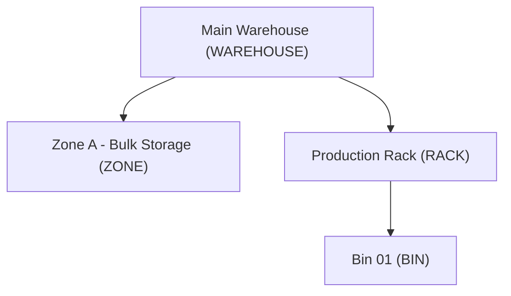

# StockSense Database Architecture & Design Guide

This directory documents the data architecture, schema definitions, and migration strategies for **StockSense**.

---

## 1. Architectural Pillar: The Ledger-vs-Balances Design Decision

A common anti-pattern in amateur inventory systems is treating stock as a simple mutable integer field on the `products` table:

```sql
-- ❌ ANTI-PATTERN: DO NOT DO THIS
UPDATE products SET quantity = quantity - 5 WHERE id = '...';
```

StockSense explicitly rejects this anti-pattern. Inventory management is a **stateful, financial-grade workflow engine**, not a generic CRUD app.

To satisfy the non-negotiable requirements of auditability, location awareness, concurrency safety, and high-performance reads, StockSense implements a **dual-model architecture**:

1. **`stock_ledger`**: The immutable, append-only source of truth.
2. **`stock_balances`**: The derived, materialized read-model cache.

> **CRITICAL WARNING FOR CONTRIBUTORS:**  
> Do **NOT** "simplify" this schema by deleting `stock_balances` to rely solely on aggregations, nor by deleting `stock_ledger` to rely solely on mutable balance counters. Both tables are essential. Removing either breaks core functional and non-functional requirements.

---

## 2. Why Both Tables Exist

| Dimension            | `stock_ledger` (Append-Only Event Store)                                                   | `stock_balances` (Materialized Read-Model)                                                |
| -------------------- | ------------------------------------------------------------------------------------------ | ----------------------------------------------------------------------------------------- |
| **Primary Purpose**  | Complete audit trail, Move History, regulatory compliance, historical state reconstruction | O(1) fast reads for dashboards, low-stock evaluations, and inventory availability queries |
| **Write Pattern**    | `INSERT` only. **Never `UPDATE` or `DELETE`.**                                             | `UPSERT` / `UPDATE` within the document validation transaction.                           |
| **Granularity**      | Every individual movement (delta) per location, per product, per document, per actor       | Current aggregate stock per `(product_id, location_id)` pair                              |
| **Concurrency Role** | Historical record of committed operations                                                  | Concurrency lock target (`SELECT ... FOR UPDATE`) to serialize validations                |
| **Rebuildability**   | Irreplaceable source of truth                                                              | 100% rebuildable by replaying `stock_ledger` entries                                      |

---

## 3. Deep Dive: `stock_ledger` (The Immutable Source of Truth)

Every stock change in StockSense must originate from a **validated document** (`Receipt`, `Delivery`, `Internal Transfer`, `Stock Adjustment`).

When a document transitions to `DONE`, the system writes one or more rows to `stock_ledger`:

- **`qty_delta`**: Signed integer representing the quantity delta (`+` for receipt/inbound, `-` for delivery/outbound).
- **`balance_after`**: The running balance at that location immediately following the posting.
- **`actor_id`**: The user who validated the document.
- **`document_id`**: Foreign key linking the movement to the business voucher.
- **`posted_at`**: High-precision timestamp.

### Internal Transfers & The Dual-Entry Invariant

For an **Internal Transfer** (moving stock from Warehouse A to Rack B), two rows are inserted into `stock_ledger` within the same transaction:

1. `(product_id, location_A, qty_delta: -30, balance_after: ...)`
2. `(product_id, location_B, qty_delta: +30, balance_after: ...)`

**The total quantity delta across the system nets exactly to zero (`-30 + 30 = 0`).** Stock remains unchanged in total, but location-specific balances are accurately shifted.

### Codebase Rule

**No `UPDATE` or `DELETE` queries against `stock_ledger` may exist anywhere in the codebase.**  
Prisma client services must only expose `create` and `findMany` methods for `StockLedger`. Physical or logical deletion is forbidden.

---

## 4. Deep Dive: `stock_balances` (The Fast Read Model)

Without `stock_balances`, computing the current stock of 10,000 SKUs across 20 warehouses would require aggregating millions of `stock_ledger` rows on every dashboard load:

```sql
-- ❌ Unacceptable O(N) cost on every page load:
SELECT SUM(qty_delta) FROM stock_ledger WHERE product_id = $1 AND location_id = $2;
```

`stock_balances` maintains a real-time running total keyed by `(product_id, location_id)`:

- **O(1) Dashboard Reads**: KPI queries ("Total Stock Value", "Low Stock Alerts", "Items Out of Stock") execute instant indexed lookups.
- **Database-Level Integrity**: A DB-level check constraint (`CHECK (quantity >= 0)`) prevents stock from going negative at the database engine level (preventing phantom backorders).
- **Concurrency Serialization**: When validating a document, the backend executes:
  ```sql
  SELECT * FROM stock_balances
  WHERE product_id = $1 AND location_id = $2
  FOR UPDATE;
  ```
  This row lock forces concurrent validations for the same SKU/location to serialize cleanly, preventing race conditions and double-spending of stock.

---

## 5. The Validation Transaction Lifecycle

Every document validation runs inside a single, atomic PostgreSQL transaction (`validate-document.tx.ts`):

```
┌────────────────────────────────────────────────────────────────────────┐
│                      Document Validation Transaction                   │
├────────────────────────────────────────────────────────────────────────┤
│ 1. Acquire row lock:                                                  │
│    SELECT * FROM stock_balances WHERE (product, location) FOR UPDATE; │
│                                                                        │
│ 2. Check business invariants:                                          │
│    - Balance >= requested qty (for deliveries & outgoing transfers)   │
│                                                                        │
│ 3. Insert append-only row(s) to stock_ledger:                          │
│    INSERT INTO stock_ledger (product, location, delta, balance_after); │
│                                                                        │
│ 4. Update materialized stock_balances:                                 │
│    UPDATE stock_balances SET quantity = quantity + delta;              │
│    (Enforced by CHECK (quantity >= 0))                                │
│                                                                        │
│ 5. Update document status:                                             │
│    UPDATE documents SET status = 'DONE', validated_at = NOW();        │
│                                                                        │
│ 6. Commit transaction & dispatch async events:                         │
│    - stock.changed event -> Low-stock alert worker & WebSocket push    │
└────────────────────────────────────────────────────────────────────────┘
```

If any step fails (e.g. insufficient stock or CHECK constraint violation), the entire transaction rolls back automatically with zero partial state corruption.

---

## 6. Location Tree Hierarchy (ERPNext Model)

Locations are modeled using a single self-referencing table `locations(id, name, type, parent_id)` rather than separate tables per level (`warehouses`, `zones`, `racks`, `bins`):



This single-table hierarchy allows arbitrary tree depth, unified location lookups, and flexible internal routing without schema migrations.

---

## 7. Migration & Seed Operations

- **Run Migrations**:
  ```bash
  pnpm --filter backend prisma migrate dev
  ```
- **Seed Demo Dataset (Idempotent)**:
  ```bash
  pnpm seed
  ```
- **Rollback Migration**:
  ```bash
  pnpm db:rollback
  ```
- **Inspect / Verify Database**:
  ```bash
  pnpm exec tsx scripts/verify-db.ts
  ```
